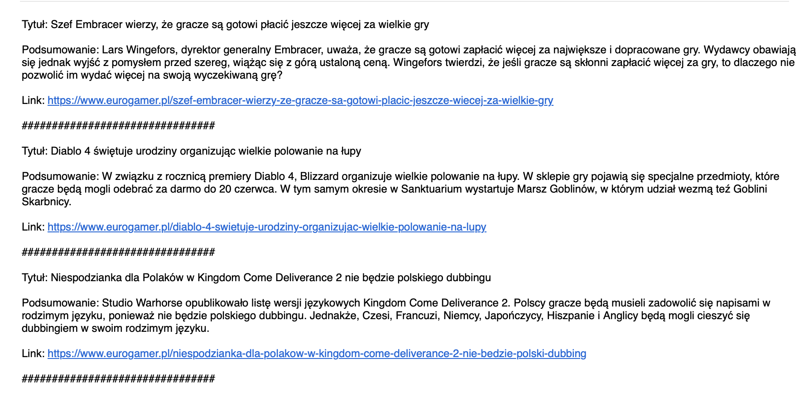

# GameFlash
Skrypt do podsumowywania newsów z branży gier

## Jak to działa?

Skrypt wykorzystuje [Jina AI](https://jina.ai) do konwersji podanej strony internetowej na czysty format Markdown. Następnie model LLama3 70B wyodrębnia z niej jedynie linki do artykułów. W kolejnym kroku skrypt pobiera treść z każdego z tych artykułów i generuje ich podsumowania.

## Uruchomienie

Instalujemy potrzebne paczki `pip3 install -r requirements.txt`

Model LLama3 70B jest używany za pośrednictwem [Groq](https://groq.com), dlatego wymagany jest klucz API, który można uzyskać [tutaj](https://console.groq.com/keys)

Aby skrypt działał poprawnie, należy wypełnić zawartość pliku `.env.example` oraz zmienić jego nazwę na `.env`

Przykładowy wynik:

